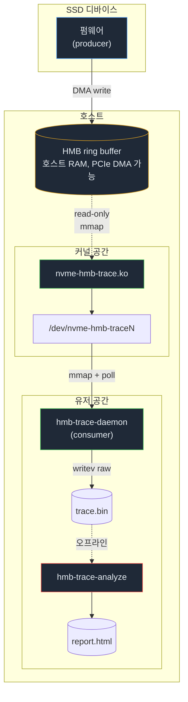
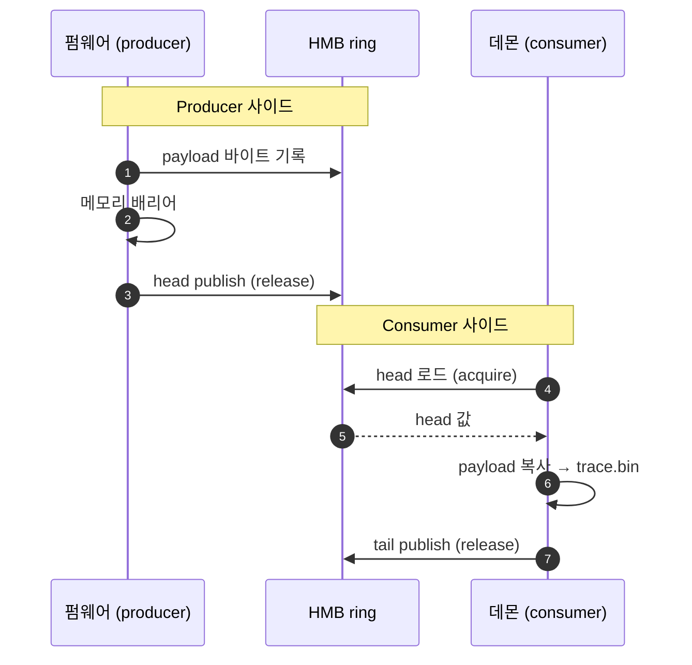
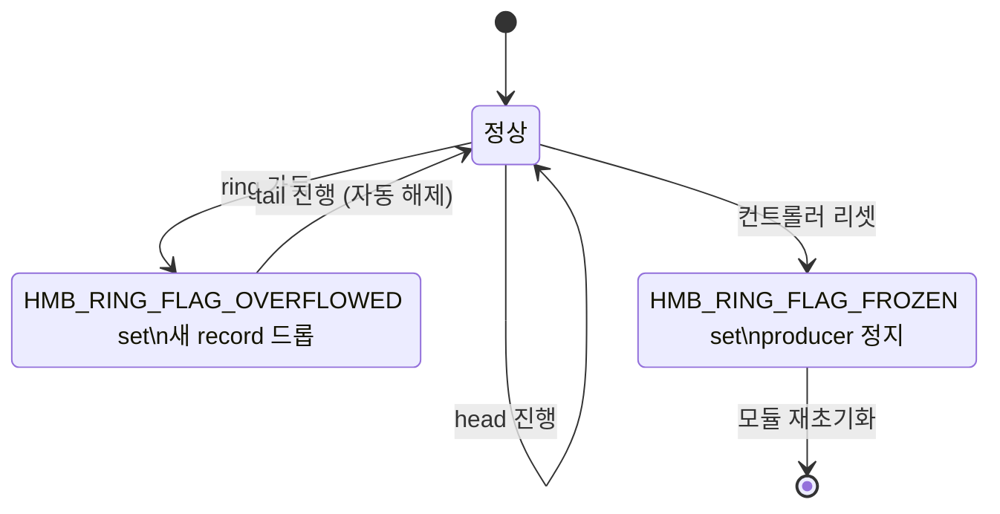

# 아키텍처
{: .no_toc }

컴포넌트 분리, 데이터 흐름, 실패 모드, 성능 특성을 다룹니다. 바이트 수준 규약은 [트레이스 포맷](trace-format.html), 시스템 콜 표면은 [ABI](abi.html)를 참고하세요.
{: .fs-5 .fw-300 }

  
목차

  {: .text-delta }
- TOC
{:toc}

---

## 데이터 흐름

## 모듈 분리 원칙

커널 모듈은 **의도적으로 작게** 유지합니다: HMB 영역 carve-out, 캐릭터 디바이스 등록, mmap·poll 노출이 전부입니다. payload는 건드리지 않고, 디코딩된 상태도 유지하지 않습니다.

NVMe 코어에 손을 대는 부분은 `kernel/patches/`에 별도 패치 시리즈로 분리되어 있으며, 다음을 수행합니다.

1. HMB의 일부를 트레이스 ring 용으로 예약(나머지는 기존대로 컨트롤러 캐시).
2. 디바이스에 영역을 광고하기 전 `hmb_ring_hdr`(magic, version, size 등)를 초기화.
3. 예약된 슬라이스 포인터를 `nvme-hmb-trace.ko`가 접근할 수 있도록 컨트롤러 구조체에 추가.

## SPSC 규율

Producer(펌웨어)와 consumer(데몬)는 **정확히 한 쌍**입니다. 캐릭터 디바이스의 `open`은 배타적이라 두 번째 컨슈머는 `-EBUSY`를 받습니다. 이 단일 producer / 단일 consumer 가정 위에서 lockless ring을 단순한 acquire/release로 구현할 수 있습니다.

자세한 publish/visibility 규약은 [동작 과정](operation.html) 5장을 보세요.

## 실패 모드

| 상황                            | 책임 주체   | 회복 방법                                                  |
|---------------------------------|-------------|------------------------------------------------------------|
| Producer가 consumer를 추월      | 펌웨어      | `HMB_RING_FLAG_OVERFLOWED` set, tail 진행 시 자동 해제     |
| 데몬이 사망                     | systemd 등  | 재시작; 펌웨어는 ring이 찰 때까지 계속 produce             |
| 컨트롤러 리셋                   | 펌웨어      | `HMB_RING_FLAG_FROZEN` set, replay 없음, hdr 재초기화 필요 |
| 잘못된 magic / 너무 새 version  | 데몬        | 비제로 종료 코드로 abort                                   |

## 성능 메모

- mmap 경로에는 **레코드당 syscall 오버헤드가 없습니다.** 컨슈머는 `head`를 폴링하고 `poll(2)`을 sleep fallback으로 사용합니다.
- 데몬의 hot path는 헤더 iovec + payload iovec 두 개로 구성된 `writev(2)`이며, **레코드당 `malloc`이 없습니다**.
- 페이로드 최대 길이는 v1에서 `4096 - 32 = 4064` 바이트입니다. 더 큰 이벤트는 펌웨어가 분할해야 합니다.
- `head`/`tail` 카운터는 modulo가 아닌 단조 증가 64비트 정수이므로, 실용적으로 wrap을 무시할 수 있고 정수 비교로 가득/빈 판정이 가능합니다.

## 보안/안전성 경계

- mmap은 **read-only**입니다(`PROT_WRITE`는 `EACCES`로 거부). 컨슈머가 ring을 더럽힐 수 없습니다.
- 캐릭터 디바이스 접근 권한은 udev 규칙으로 좁힙니다(예: `mode=0440 group=hmbtrace`).
- 호스트에서 모듈을 적재(`insmod`)하는 행위는 **금지**입니다. 모든 적재 작업은 `mock/`의 QEMU 게스트에서만 수행합니다.

## 디렉토리 ↔ 책임 매트릭스

| 디렉토리      | 책임                                                          |
|---------------|---------------------------------------------------------------|
| `kernel/module/`  | LKM: 캐릭터 디바이스, mmap, poll, ioctl. payload 무관심.  |
| `kernel/patches/` | NVMe 코어 변경: HMB 분할 + hdr 초기화.                    |
| `daemon/`         | mmap consumer 루프, magic/length 검증, raw 파일 dump.     |
| `analyzer/`       | 오프라인 디코딩, opcode 카탈로그, 통계/CSV 출력.          |
| `docs/`           | ABI/포맷 명세 — 코드와 어긋나면 **이쪽이 우선**(수정 전까지).|
| `mock/`           | QEMU 하네스. 위험 명령 격리 경계.                         |
