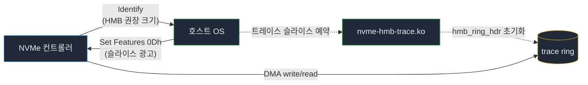
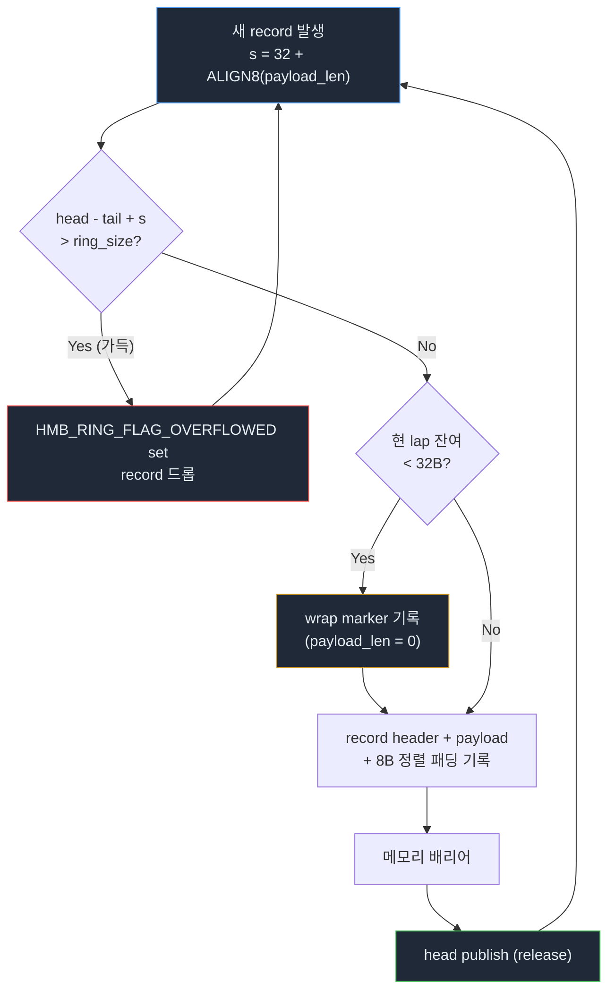
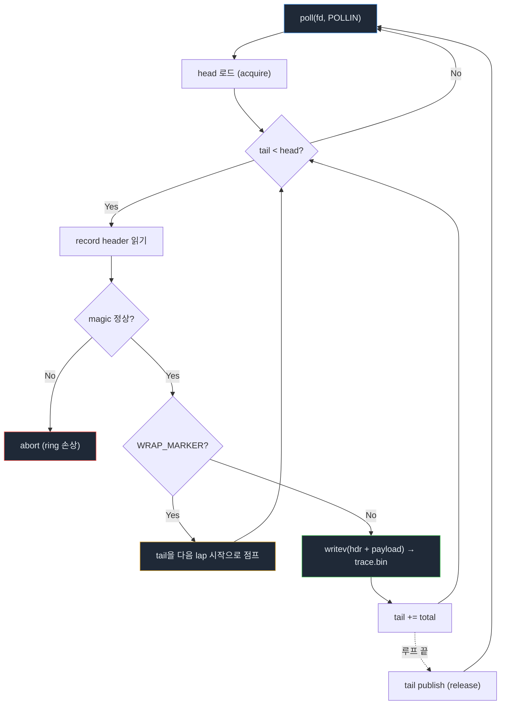
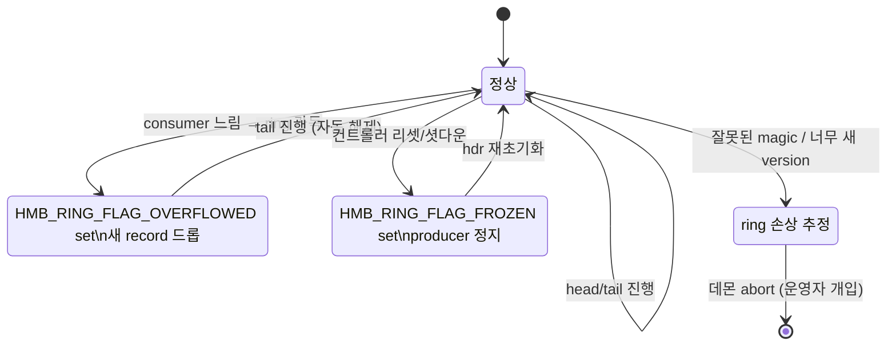

# 동작 과정
{: .no_toc }

펌웨어가 HMB 링에 트레이스를 쌓고, 커널이 그것을 노출하고, 데몬이 비우고, 분석기가 해석하는 전체 흐름을 단계별로 설명합니다.
{: .fs-5 .fw-300 }

<details open markdown="block">
  <summary>목차</summary>
  {: .text-delta }
- TOC
{:toc}
</details>

---

## 1. HMB 영역 확보 (호스트 ↔ 컨트롤러 핸드셰이크)

NVMe 컨트롤러는 초기화 시 `Identify Controller`로 자신이 요구하는 HMB 권장 크기를 호스트에 알립니다. 호스트는 그만큼의 호스트 메모리를 `Set Features (Host Memory Buffer, FID=0Dh)` 명령으로 컨트롤러에 등록합니다. 이 영역은 PCIe DMA로 컨트롤러가 직접 읽고 쓸 수 있습니다.

본 프로젝트의 NVMe 코어 패치는 이 HMB 영역의 한 조각을 떼어 **트레이스 전용 슬라이스**로 예약합니다.

<style>
.memmap { width: 100%; border-collapse: separate; border-spacing: 0; margin: 12px 0; font-family: ui-monospace, SFMono-Regular, Menlo, monospace; font-size: 13px; }
.memmap th { background: #1f2937; color: #e6edf3; text-align: left; padding: 8px 12px; border: 1px solid #30363d; font-weight: 600; }
.memmap td { padding: 10px 12px; border: 1px solid #30363d; vertical-align: top; background: #0d1117; color: #e6edf3; }
.memmap td.addr { width: 90px; color: #d29922; font-weight: 600; }
.memmap td.size { width: 90px; color: #8b949e; }
.memmap td.content { color: #e6edf3; }
.memmap td.content small { color: #8b949e; }
.memmap tr.split td { padding: 0; }
.memmap .split-inner { display: grid; grid-template-columns: 1fr 1fr; gap: 0; }
.memmap .split-inner > div { padding: 10px 12px; }
.memmap .split-inner > div + div { border-left: 1px solid #30363d; }
.memmap .split-inner .tag { color: #58a6ff; font-weight: 600; }
.memmap .split-inner .tag-trace { color: #3fb950; }
</style>

<table class="memmap">
  <thead>
    <tr><th colspan="3">HMB (호스트 RAM · PCIe DMA 가능)</th></tr>
  </thead>
  <tbody>
    <tr class="split">
      <td colspan="3">
        <div class="split-inner">
          <div><span class="tag">컨트롤러용 일반 캐시</span><br><small>FTL 매핑 캐시, 파라미터 등</small></div>
          <div><span class="tag tag-trace">트레이스 슬라이스</span><br><small>hmb_ring_hdr (64B) + record area</small></div>
        </div>
      </td>
    </tr>
  </tbody>
</table>

트레이스 슬라이스의 시작 64바이트는 `struct hmb_ring_hdr`, 그 뒤가 record area입니다. 자세한 레이아웃은 [트레이스 포맷](trace-format.html)에 정의되어 있습니다.



## 2. 캐릭터 디바이스 노출

`nvme-hmb-trace.ko` 모듈은 컨트롤러별로 `/dev/nvme-hmb-traceN` 캐릭터 디바이스를 생성합니다. 유저스페이스는 다음 시스템 콜로 트레이스 영역을 다룹니다.

| syscall  | 동작                                                                 |
|----------|----------------------------------------------------------------------|
| `open`   | 트레이스 ring에 대한 **배타적 컨슈머 잠금** 획득 (SPSC 보장)         |
| `ioctl(NVME_HMB_TRACE_GET_INFO)` | ring 크기, record area 오프셋, mmap 길이 반환 |
| `mmap`   | HMB 영역 전체를 **read-only**로 유저스페이스에 매핑                   |
| `poll`   | `head != tail`이면 `POLLIN`을 돌려 컨슈머를 깨움                      |
| `close`  | 잠금 해제 (ring은 drain하지 않음)                                     |

## 3. Producer: 펌웨어의 기록



펌웨어는 컨슈머의 `tail`을 절대 덮어쓰지 않습니다(SPSC).

## 4. Consumer: 데몬의 회수

`hmb-trace-daemon`은 다음 루프를 돕니다.



**중요:** 데몬은 payload를 **해석하지 않습니다**. magic/version/payload_len 만 검증하고, 디코딩은 분석기가 수행합니다.

### 시그널과 출력 파일

- `SIGINT`/`SIGTERM` → 다음 record 경계까지 진행 후 정상 종료.
- `SIGHUP` → 출력 파일 재오픈(`logrotate` 등 외부 회전기와 협업).
- 출력 파일은 `O_CLOEXEC | O_CREAT | O_APPEND`로 열립니다.

## 5. 동기화 모델

```mermaid
sequenceDiagram
    autonumber
    participant FW as 펌웨어 (producer)
    participant H as HMB ring
    participant D as 데몬 (consumer)

    rect rgb(31, 41, 55)
    Note over FW,H: Producer
    FW->>H: payload 바이트 기록
    FW->>FW: 메모리 배리어 (release)
    FW->>H: head publish
    end

    rect rgb(31, 41, 55)
    Note over D,H: Consumer
    D->>H: head 로드 (acquire)
    H-->>D: head 값
    D->>D: payload 복사 → trace.bin
    D->>H: tail publish (release)
    end
```



| 위치          | 변수    | 누가 쓰나          | 누가 읽나        | 메모리 오더    |
|---------------|---------|--------------------|------------------|----------------|
| `ring_hdr.head` | head  | 펌웨어(producer)   | 데몬(consumer)   | producer release / consumer acquire |
| `ring_hdr.tail` | tail  | 데몬(consumer)     | 펌웨어(producer) | consumer release / producer acquire |
| record bytes  | payload | 펌웨어             | 데몬             | head publish 이전에 쓰기 완료 보장  |

`head`/`tail`은 modulo가 아닌 **단조 증가** 카운터입니다. 실제 record area 안 오프셋은 `cursor & (ring_size - 1)`로 계산합니다. 따라서 정수 비교(`tail < head`)만으로 가득/빈 상태를 판별할 수 있고, ABA 문제도 없습니다.

## 6. 실패 모드와 회복



| 상황                          | 표시 방법                            | 회복                                              |
|-------------------------------|---------------------------------------|---------------------------------------------------|
| 컨슈머가 너무 느려 ring 가득  | `HMB_RING_FLAG_OVERFLOWED` set        | 펌웨어는 record를 드롭, tail 진행 시 자동 해제    |
| 컨트롤러 리셋 / 종료          | `HMB_RING_FLAG_FROZEN` set            | 컨트롤러 재초기화 후 hdr를 재초기화하고 재시작    |
| 데몬 크래시                   | 외부 supervisor(systemd) 재시작       | ring은 그대로 유지, 새 데몬이 이어서 drain        |
| ring 손상(잘못된 magic 등)    | 데몬이 abort, non-zero exit           | 운영자가 dump 보존 후 컨트롤러 리셋               |

## 7. 오프라인 분석

`hmb-trace-analyze`는 데몬이 떨어뜨린 raw dump 파일을 입력으로 받습니다. 모든 record를 순차로 디코드하며, 첫 record의 `magic` 으로 dialect를 식별합니다.

```
$ uv run hmb-trace-analyze decode /tmp/trace.bin
$ uv run hmb-trace-analyze stats   /tmp/trace.bin
$ uv run hmb-trace-analyze convert /tmp/trace.bin out.csv
```

분석기가 `version > HMB_TRACE_ABI_VERSION` 인 dump를 만나면 즉시 명확한 에러로 거부합니다 — 잘못된 해석을 방지하기 위함입니다.

---

다음으로 읽어 보세요: [개발 튜토리얼](tutorial.html) · [트레이스 포맷 명세](trace-format.html) · [ABI](abi.html)
